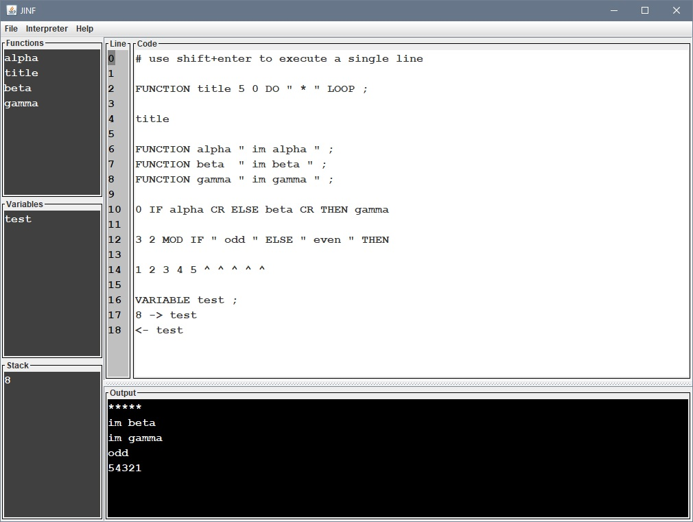

# JINF
JINF is an interpreter for a simple language stack based similar to Forth.

You can define with JINF your own function and variables.

You can use basic statements as if-else-then, do loop, begin until .

The interface allow you to execute all your code at once or line by line and save or load your work.

In the help section of the menu you can find all the language keywords and some examples.

Through the interface you can monitor the defined variables, functions and the current state of the stack.

# Usage
This application is written in pure Java.
To compile it use :
### javac -cp "./LIB/*" -d ./BUILD ./SRC/*.java
To run it :
### java -cp "./BUILD;./LIB/*" Main

# Examples

## Program to print the first eight numbers of fibonacci serie

VARIABLE sup ;
VARIABLE inf ;

0 -> inf
1 -> sup

8 0 DO <- inf <- sup + DUP ^ <- sup -> inf -> sup LOOP

## Program to print the number 13 as binary

VARIABLE num ;
VARIABLE count ;

13 -> num
0 -> count

BEGIN <- num 2 MOD <- num 2 / DUP 0 != IF ++ count THEN DUP -> num 0 == UNTIL

++ count <- count 0 DO ^ SPACE LOOP

# Language reference

### ^
( n -- )
Remove the value at the top of the stack and print it on the output.

### CR
( -- )
Append a carriage return to the output.

### SPACE
( -- )
Append a empty space to the output.

### " xxx "
( -- )
Append the ascii text xxx to the output.

### ==
( n1 n2  -- n1==n2 )
Remove the two values at the top of the stack and push back 1 if equals, otherwise 0.

### !=
( n1 n2  -- n1!=n2 )
Remove the two values at the top of the stack and push back 1 if equals, otherwise 0.

### \>
( n1 n2  -- n1>n2 )
Remove the two values at the top of the stack and push back 1 if n1>n2, otherwise 0.

### <
( n1 n2  -- n1<n2 )
Remove the two values at the top of the stack and push back 1 if n1<n2, otherwise 0.

### NOT
( n -- !n )
Remove the value at the top of the stack and push back the logical NOT.

### AND
( n1 n2 -- n1&n2 )
Remove the value at the top of the stack and push back the logical AND.

### OR
( n1 n2 -- n1|n2 )
Remove the value at the top of the stack and push back the logical OR.

### \+
( n1 n2 -- n1+n2 )
Remove the value at the top of the stack and push back their sum.

### \-
( n1 n2 -- n1-n2 )
Remove the value at the top of the stack and push back the difference.

### \*
( n1 n2 -- n1*n2 )
Remove the value at the top of the stack and push back their product.

### /
( n1 n2 -- n1/n2 )
Remove the value at the top of the stack and push back the result of the division.

### ++ xxx
( -- )
Increase by 1 the value of the variable named xxx.

### -- xxx
( -- )
Decrease by 1 the value of the variable named xxx.

### MOD
( n1 n2 -- n1%n2 )
Remove the value at the top of the stack and push back the reaminder of the division.

### ABS
( n -- abs(n) )
Remove the value at the top of the stack and push back the absolute value.

### NEG
( n -- -n )
Change the sign of the value at thte top of the stack.

### MIN
( n1 n2 -- min(n1,n2) )
Remove the two values at the top of the stack and push back the smallest of them.

### MAX
( n1 n2 -- max(n1,n2) )
Remove the two values at the top of the stack and push back the greatest of them.

### <<
( n -- n<<1 )
Perform the left shit of the value at the top of the stack.

### \>\>
( n -- n>>1 )
Perform the right shit of the value at the top of the stack.

### DUP
( n -- n n )
Duplicates the value at the the top of the stack and push it back.

### SWAP
( n1 n2 -- n2 n1 )
Swap the values at the top of the stack.

### DROP
( n --  )
Discard the value at the top of the stack.

### FUNCTION xxx yyy ;
( -- )
Creates a new function with the name xxx, containing yyy instructions.
To execute the function just call xxx. 

### VARIABLE xxx ;
( -- )
Creates a new variable with the name xxx with value 0 by default. 

### DELETE xxx ;
( -- )
Delete the user defined function or variable named xxx. 

### DO xxx LOOP
( n1 n2 -- )
Remove the two values at the top of the stack and repeat the execution of xxx instructions for n1 times, starting from n2.

### BEGIN xxx UNTIL
( f -- )
Execute xxx until the top of the stack is 0, of consequence xxx should leave a flag on the top of the stack.

### IF xxx ELSE yyy THEN zzz
( n -- )
Remove the value at the top of the stack and if it is 1 execute xxx otherwise it execute yyy then execute zzz.
The ELSE branch is otpional.

### -> xxx
( n -- )
Remove the value at the top of the stack and put it in the variable xxx.

### <- xxx
( -- n )
Push on the stack the value of the variable xxx.

### FUNC xxx
( -- )
Print to the output the intructions of the function named xxx.

### VAR xxx
( -- )
Print to the output the value of the variable named xxx.

### \#
( -- )
Identified a comment everything after # it is ignored.
